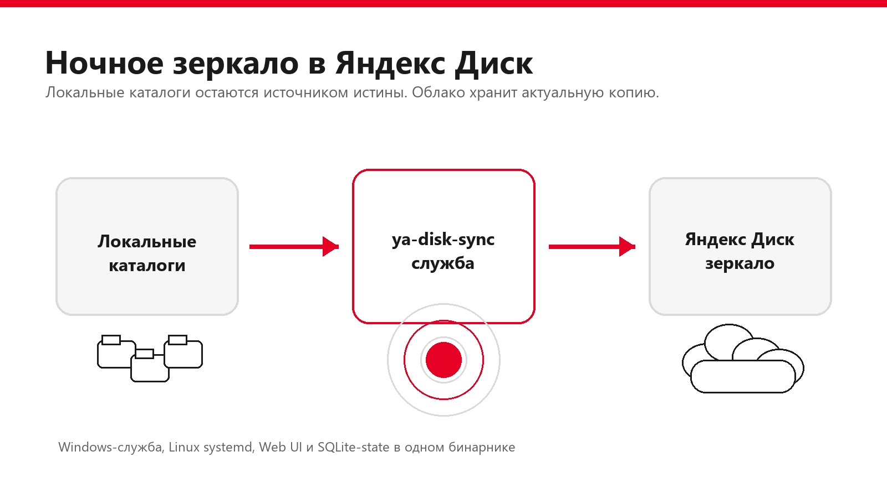
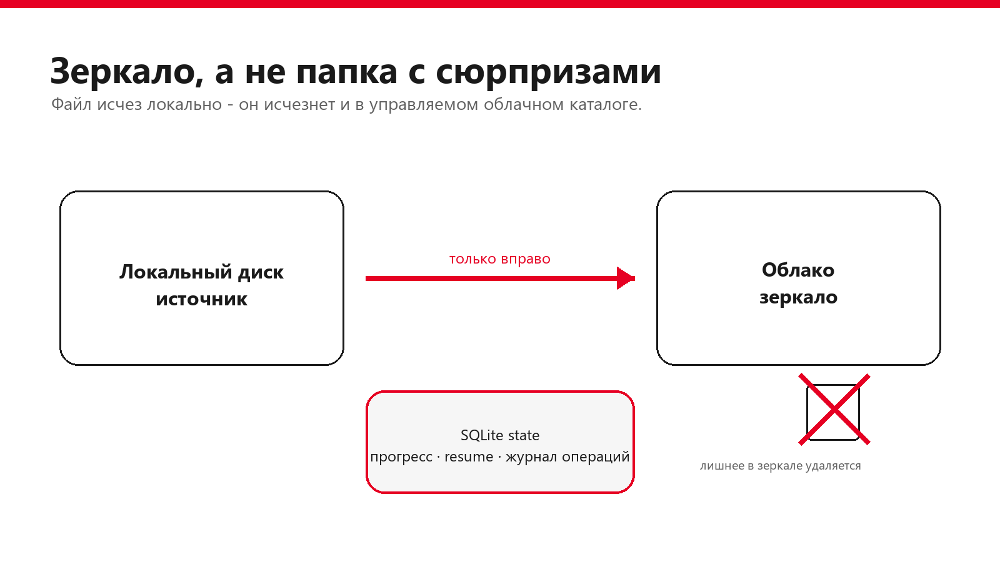
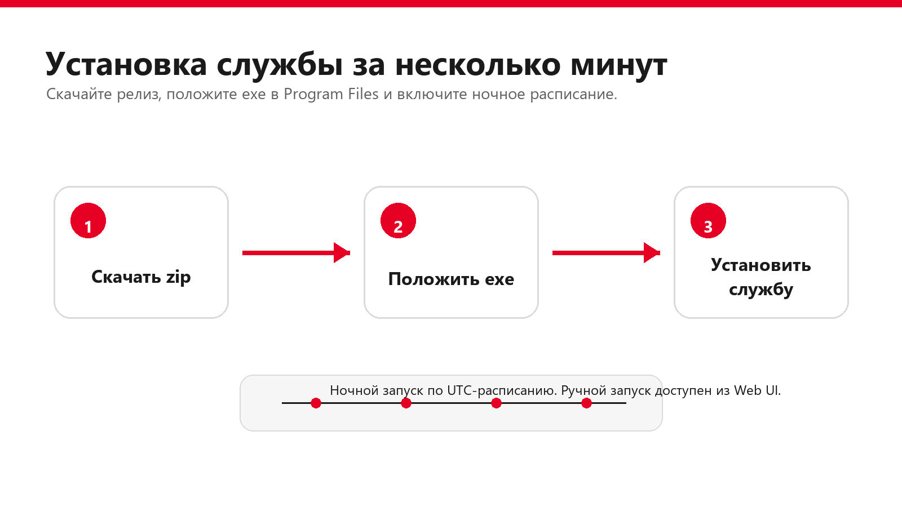

# ya-disk-sync



**ya-disk-sync** делает то, чего обычно ждут от «резервной копии в облако», но редко получают без боли: стабильно зеркалит большие рабочие каталоги в Яндекс Диск.

Проект рассчитан на тяжёлые деревья: сотни гигабайт, глубокие иерархии, почти миллион файлов и каталогов, долгие ночные прогоны, занятые файлы, временные артефакты сборки и сетевые сбои. Он не пытается быть универсальной облачной папкой. Его задача проще и жёстче: локальный диск главный, Яндекс Диск хранит актуальное зеркало.

## Почему это не «ещё один синхронизатор»

- Держит большие деревья без старта с нуля после каждого сбоя: прогресс, снимки файлов, remote inventory и журнал операций хранятся в SQLite.
- Нормально работает с глубокой иерархией: создаёт каталоги батчами, сохраняет порядок parent-before-child и не валит весь прогон из-за одного проблемного файла.
- Умеет продолжать после сетевых ошибок Яндекс Диска: повторяет запросы, не считает неполный listing безопасным и не запускает удаление по неполным данным.
- Поддерживает гибкие исключения: глобальные правила, правила на root, абсолютные пути, gitignore-подобные маски, отрицания через `!pattern`.
- Не грузит всё подряд: большие файлы планируются отдельно, SQLite-базы копируются через Online Backup API, WAL/SHM исключаются по умолчанию.
- Работает как Windows-служба, foreground daemon или Linux systemd-сервис. Есть локальный Web UI, статус, логи и ручной запуск.
- Хранит OAuth-токены в системном keyring. JSON-конфиг остаётся конфигом, а не кладбищем секретов.
- Использует собственный Rust-клиент Яндекс Диска. Не вызывает `yacli` или другой внешний CLI для рабочих операций.

В рабочем state уже учтено 859 012 локальных file/directory записей, из них 843 150 со статусом `synced`; кэш удалённого inventory хранит 726 157 ресурсов Яндекс Диска. Это не демо на десятке файлов. Узким местом обычно становится не scanner, а скорость API и канала до Яндекс Диска.

## Модель зеркала



`ya-disk-sync` работает в одну сторону:

```text
локальные каталоги -> Яндекс Диск
```

Если файл есть локально и его нет в облаке, он будет загружен. Если файл есть в облаке и совпадает с локальным, он будет принят без повторной загрузки. Если файл есть в управляемом облачном каталоге, но отсутствует локально, он будет удалён из облака.

Это важное отличие от двусторонней синхронизации. Проект подходит для управляемого зеркала и резервного просмотра данных, а не для ручного редактирования одной и той же папки с разных компьютеров.

## Быстрый старт на Windows



1. Скачайте архив `ya-disk-sync-0.1.0-windows-x86_64.zip` из [Releases](https://github.com/aresyn/ya-disk-sync/releases).
2. Распакуйте его, откройте PowerShell от имени администратора и выполните:

```powershell
.\scripts\install-windows-service.ps1
```

Скрипт копирует `ya-disk-sync.exe` в `C:\Program Files\YaDiskSync`, создаёт рабочие каталоги в `C:\ProgramData\YaDiskSync` и устанавливает службу.

Минимальная ручная установка без скрипта:

```powershell
New-Item -ItemType Directory -Force -Path 'C:\Program Files\YaDiskSync' | Out-Null
Copy-Item .\ya-disk-sync.exe 'C:\Program Files\YaDiskSync\ya-disk-sync.exe' -Force

& 'C:\Program Files\YaDiskSync\ya-disk-sync.exe' --config 'C:\ProgramData\YaDiskSync\config\config.json' config init
& 'C:\Program Files\YaDiskSync\ya-disk-sync.exe' --config 'C:\ProgramData\YaDiskSync\config\config.json' config validate
& 'C:\Program Files\YaDiskSync\ya-disk-sync.exe' --config 'C:\ProgramData\YaDiskSync\config\config.json' service install --force
& 'C:\Program Files\YaDiskSync\ya-disk-sync.exe' service start
```

После этого откройте локальный интерфейс:

```powershell
& 'C:\Program Files\YaDiskSync\ya-disk-sync.exe' --config 'C:\ProgramData\YaDiskSync\config\config.json' web open
```

По умолчанию Web UI слушает `127.0.0.1:17691`.

## Настройка корней синхронизации

`config init` создаёт безопасный пример. В нём корни выключены, чтобы вы явно выбрали свои каталоги.

Пример root:

```json
{
  "id": "projects",
  "name": "Рабочие проекты",
  "enabled": true,
  "local_path": "C:\\Data\\Projects",
  "remote_path_override": "disk:/Backup/Projects",
  "legacy_remote_paths": [],
  "excludes": [
    "**/target/**",
    "**/.venv/**",
    "**/node_modules/**"
  ]
}
```

Проверьте конфиг перед запуском:

```powershell
ya-disk-sync --config C:\ProgramData\YaDiskSync\config\config.json config validate
```

## Исключения без сюрпризов

Исключения задаются явно. Проект не скрывает `.git`, `node_modules`, `target`, `.env` и ключи сам по себе, потому что это зеркало, а не набор чужих предположений о ваших данных.

Можно настроить:

- `global_excludes` для всех корней;
- `roots[].excludes` для конкретного каталога;
- `absolute_excludes` для точного абсолютного пути и всех потомков;
- `!pattern`, чтобы вернуть путь обратно после более общего исключения.

Для рабочих проектов обычно стоит явно исключить build/cache-каталоги: `target`, `node_modules`, `.venv`, `.cache`, `.pytest_cache`, `.mypy_cache`, `.gradle`, `bin`, `obj`, `.vs`.

## Авторизация Яндекс Диска

Токены хранятся в системном keyring. В JSON-конфиг они не попадают.

```powershell
ya-disk-sync --config C:\ProgramData\YaDiskSync\config\config.json auth login --client-id "<yandex-oauth-client-id>"
ya-disk-sync --config C:\ProgramData\YaDiskSync\config\config.json auth status
```

Если на машине уже настроен совместимый `yacli`, можно попробовать импорт:

```powershell
ya-disk-sync --config C:\ProgramData\YaDiskSync\config\config.json auth import-yacli
```

Импорт не запускает внешний `yacli` и не печатает токен.

## Первый запуск

Для существующего каталога в Яндекс Диске используйте migration/adoption. Он сравнит локальный и удалённый состав, примет совпадающие файлы без повторной загрузки и запишет состояние в SQLite:

```powershell
ya-disk-sync --config C:\ProgramData\YaDiskSync\config\config.json migration run --force-remote-rescan
```

Обычный инкрементальный запуск:

```powershell
ya-disk-sync --config C:\ProgramData\YaDiskSync\config\config.json sync run
```

Статус службы:

```powershell
ya-disk-sync --config C:\ProgramData\YaDiskSync\config\config.json status
ya-disk-sync --config C:\ProgramData\YaDiskSync\config\config.json logs tail --lines 100
```

## Кому подходит

`ya-disk-sync` хорошо подходит, если:

- нужно ночное зеркало рабочих каталогов в Яндекс Диск;
- каталог большой, глубокий и постоянно меняется;
- важно не начинать многодневную синхронизацию с нуля после перезапуска;
- нужны понятные исключения по маскам и абсолютным путям;
- нужна Windows-служба без Docker и без отдельного web stack;
- хочется хранить состояние локально и проверять, что именно было загружено, пропущено или удалено.

## Кому не подходит

Проект не стоит использовать как двустороннюю облачную папку. Если вы хотите редактировать один и тот же каталог с нескольких компьютеров и автоматически разруливать конфликты, нужен другой инструмент.

Также это не версионирующий backup. Если файл удалён локально и root включён, лишняя копия в управляемом облачном каталоге тоже будет удалена.

## Linux

Linux-сборка поддерживает foreground daemon и systemd helper:

```bash
sudo ./ya-disk-sync --config /etc/ya-disk-sync/config.json service install --systemd --force
sudo ./ya-disk-sync service start
```

Подробнее: [docs/linux-systemd.md](docs/linux-systemd.md).

## Документация

- [Конфигурация](docs/configuration.md)
- [Модель синхронизации и state](docs/sync-model.md)
- [Первичная миграция](docs/migration.md)
- [Runtime и observability](docs/runtime.md)
- [Web UI](docs/web-ui.md)
- [Windows-служба и tray](docs/windows-service.md)
- [Linux systemd](docs/linux-systemd.md)
- [Клиент Яндекс Диска и OAuth](docs/yandex-disk-client.md)
- [Тестирование](docs/testing.md)
- [Релизы](docs/release.md)
- [Troubleshooting](docs/troubleshooting.md)
- [Разработка](docs/development.md)

## Сборка из исходников

```powershell
cargo fmt --all -- --check
cargo clippy --workspace --all-targets --all-features -- -D warnings
cargo test --workspace --all-features
cargo build --release -p yds-cli
```

Бинарник появится в `target/release/ya-disk-sync.exe` на Windows или `target/release/ya-disk-sync` на Linux.

## Лицензия

MIT. См. [LICENSE](LICENSE).
